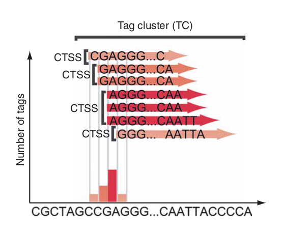
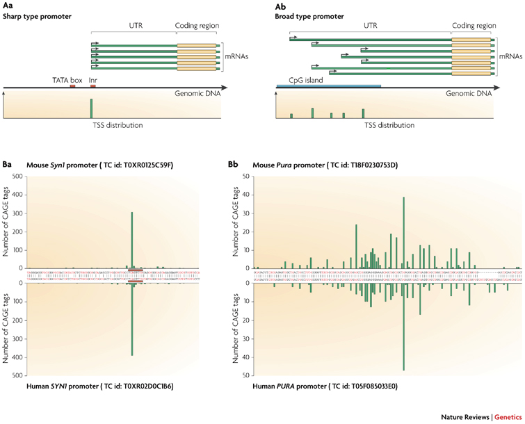
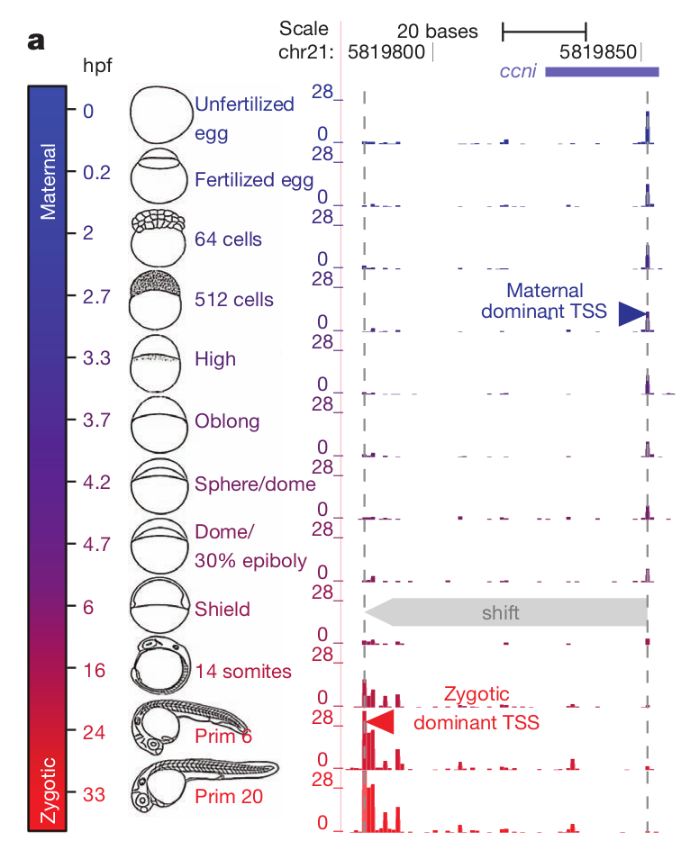
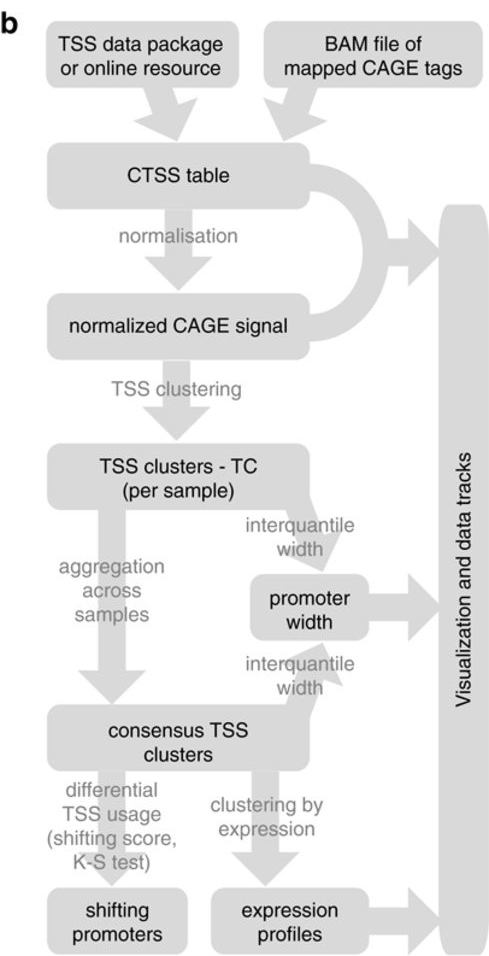
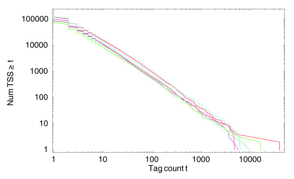

CAGE Data Analysis with CAGEr
========================================================
css: Rpress.css
author: Leonie Roos and Nevena Cvetesic
date: 11. 01. 2017.
autosize: true
width: 1440
height: 1100
css: stylesheet.css
font-import: <link href='http://fonts.googleapis.com/css?family=Slabo+27px' rel='stylesheet' type='text/css'>
font-family: 'Slabo 27px', serif;
css:style.css

Overview
========================================================
<br>
- Cage Data
- Publicly available CAGE-seq data

__CAGEr__
- A CAGEset object
- Normalization
- Promoter width
- Expression patterns
- Promoter shiftingCreate tag clusters of CTSSs
   

CAGE data
========================================================
type: sub-section


CAGE data
========================================================
<br>
__CAGE data provides information on two aspects of the captured RNAs:__

1. The exact position of TSSs
2. Relative usage frequency of TSSs

For studies into promoter architecture and 5'end transcriptome profiles

CAGE signal
========================================================
<br>
* __CAGE TSS (CTSS)__

  * CAGE tags with an identical CAGE-tag starting site.
  * Grouped and counted per genomic coordinates (CTSS table)


* __Tag cluster (TC)__

  * CTSSs in close proximity (_same strand_) 
  * 20 bp maximum distance for example



Carninci P, _et al_. Genome-wide analysis of mammalian promoter architecture and evolution. Nat Genet 2006;38, 626-635. 


CAGE signal - comparing across samples
========================================================
<br>
__TCs are sample specific__

But how we compare TCs across samples?

We create __Consensus clusters__


CAGE data - Promoter classes
========================================================
<br>
__Two major promoter classes__

* __Sharp__ - One predominant TSS
  * often associated with a _TATA-box_
<br>
* __Broad__ - Wider distribution of TSS
  * often overlapping a _CpG island_ (CGI)


<br>
Sandelin A, _et al_. Mammalian RNA polymerase II core promoters: insights from genome-wide studies. Nat Rev Gen 2007;8, 424-436.

CAGE data - Shifting Promoters
========================================================
<br>

__TSS shifting__ <br><br>
Capped RNAs initiated from different TSS positions 

* for example during zebrafish development



<br>
Haberle V, _et al_. Two independent transcription initiation codes overlap on vertebrate core promoters. Nat 2014;507(7492):381-385. 


Available CAGE-seq data
========================================================
There are quite a few publicly available CAGE-seq datasets that can be easily uploaded into __R__ <br>
<br>

- __FANTOM 5__ 
  - Human and mouse primary cells, cell lines, and tissues. 
  
- __FANTOM 3 and 4__
  - Humand and mouse tissues and several timecourses
  
- __ENCODE__
  - The common human cell lines
  
- __Zebrafish Developmental Timecourse__
  - Twelve stages of zebrafish development 
<br>
<br>

> The references are at the end of the presentation


Available CAGE-seq data - Import into R
========================================================
The different releases and where to find them
<br>
<br>
- __FANTOM 5__ 
  - _Location:_   http://fantom.gsc.riken.jp/5/data/
  - _Format:_ Files with genomic coordinates and number of tags mapping to each TSS
  
- __FANTOM 3 and 4__
  - _Location:_ http://www.bioconductor.org/packages/release/data/experiment/html/FANTOM3and4CAGE.html
  - _Format:_ R package
  
- __ENCODE__
  - _Location:_ http://promshift.genereg.net/CAGEr
  - _Format:_ R packge 
  
- __Zebrafish Developmental Timecourse__
  - _Location:_ http://promshift.genereg.net/CAGEr
  - _Format:_ R packge 


The CAGEr R Package
========================================================
type: sub-section

CAGEr Workflow
========================================================


Haberle V, _et al_. CAGEr: precise TSS data retrieval and high-resolution promoterome mining for integrative analyses. Nucl Acids Res 2015;43(8):e51.  


Import CAGE data & create CTSS table
========================================================
type: prompt


Import into CAGEr
========================================================
<br>
__Three types of CAGE data input supported by__ ___CAGEr___

1. CAGE tags mapped to genome
  - Bam files
  - BED files of CAGE tags
  
2. CTSS files
  - Tab separated files with genomic coordinates and number of CAGE tags for CTSS
    
3. CAGE datasets from R packages

<br>
__From all of these we can create a CAGEset (myCAGEset)__

- _The basis from wich the CAGEr functions work_


Zebrafish CTSS data import from R package
========================================================
<br>

```r
# packages
require(ZebrafishDevelopmentalCAGE)
require(CAGEr)

# loading data
data(ZebrafishSamples)
ZebrafishSamples
```

```
         dataset       group              sample
1  ZebrafishCAGE development zf_unfertilized_egg
2  ZebrafishCAGE development   zf_fertilized_egg
3  ZebrafishCAGE development          zf_64cells
4  ZebrafishCAGE development         zf_512cells
5  ZebrafishCAGE development             zf_high
6  ZebrafishCAGE development           zf_oblong
7  ZebrafishCAGE development      zf_sphere_dome
8  ZebrafishCAGE development      zf_30perc_dome
9  ZebrafishCAGE development           zf_shield
10 ZebrafishCAGE development        zf_14somites
11 ZebrafishCAGE development            zf_prim6
12 ZebrafishCAGE development           zf_prim20
```

```r
# samples
samples <- as.character(ZebrafishSamples$sample) 
```

The CAGEset is created right away with the CTSS information

```r
myCAGEset <- importPublicData(source = "ZebrafishDevelopment", 
                              dataset = "ZebrafishCAGE", 
                              group = "development", 
                              sample = samples[c(4,11)]  )
```


CAGE tags mapped to genome 
========================================================
<br>
The main difference is the __added step of determining the CTSSs__:

```r
# packages
require(ZebrafishDevelopmentalCAGE)
require(CAGEr)

myCAGEset = new("CAGEset", genomeName = "BSgenome.Drerio.UCSC.danRer7", 
                inputFiles = file.path(..), inputFilesType = "bam",
                sampleLabels = c("zf_512cells","zf_prim6") # empty
```
From here we need to run the following to create the CTSS table for the myCAGEset

```r
getCTSS(myCAGEset)
```


Additional Functions & Analyses
========================================================
type: prompt


Normalization
========================================================
<br>
Library size differ between samples <br><br>
__To make samples comparable, we will need to normalize our data.__

  - Tags per million normalization
  - power-law based normalization

Many CAGE-seq data follow a power-law distrubtion.


<br>
On a log-log scale this reverse cumulative distribution has a monotonically decreasing linear function:

```r
y = -1 * alpha * x + beta
```
<br>
Balwierz PJ, Carninci P, Daub CO, et al. Methods for analyzing deep sequencing expression data: constructing the human and mouse promoterome with deepCAGE data. Genome Biology. 2009;10(7):R79.


Promoter width
========================================================
__The width of Tag Clusters (TCs) and/or Consensus Clusters__

- Determined by cumulative distribution of tag signal per cluster

The promoter width is determined by two quantiles:

- 0.1
- 0.9

This is to exclude small outliers that can influence the width substantially.
<br>
<br>
<br>
__From this we can determine "sharp" and "broad" promoters!__


Promoter shifting Determination
========================================================
The method from Haberle _et al_ has been implemented in _CAGEr_. 

- Shifting is detected using cumulative distribution per sample of cange signal

- A shifting score is determined by the difference in cumulative distributions

- A Kolmogorov-Smirnov is performed to give a general assessment of differential TSS usage


Expression - Self organising maps
========================================================
CAGE signals are essentially measuring transcription starting from CTSS and thus the transcription levels can be assessed. This can be done per CTSSs, TCs, or consensus clusters. <br>
_CAGEr_ offers two methods to cluster gene expression to identify gene expression patterns:

- k-means clustering
- self-organising maps (SOM)

Both require the number of expression clusters to be known _a priori_. <br>
Here we will perform the SOM algorithm at consensus cluster level for our two samples to identify expression patterns. We set the threshold to at least 10 tpm (normalized) in at least one sample to make sure we have robustly expressed TCs within the consensus clusters. <br>
The function is `getExpressionProfiles()` and in here we define that we expect in this case 6 clusters (`xDim = 3, yDim = 2`).


```
Error in getExpressionProfiles(myCAGEset, what = "consensusClusters",  : 
  object 'myCAGEset' not found
```
