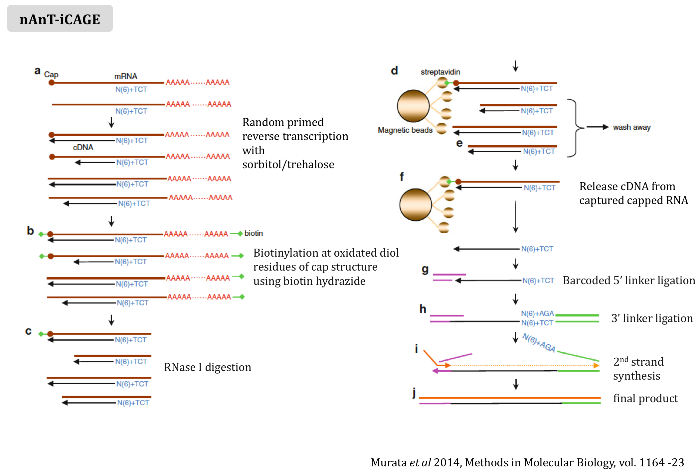
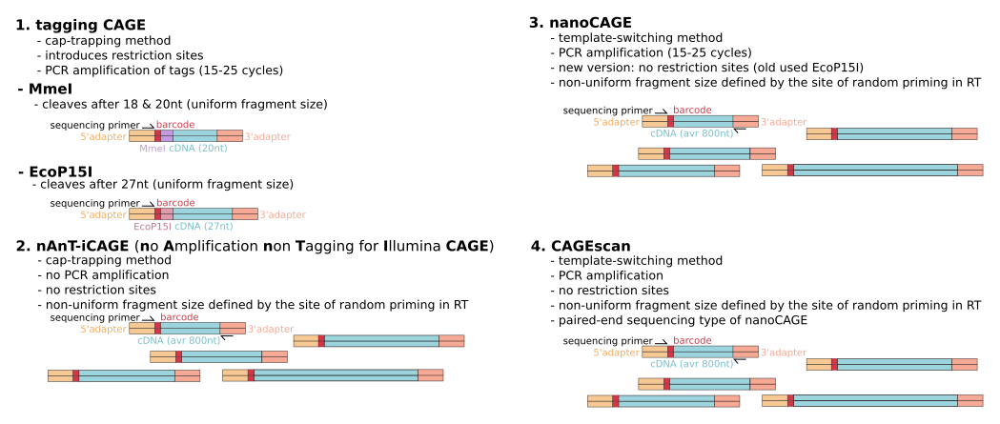

CAGE
========================================================
css: Rpress.css
author: Leonie Roos and Nevena Cvetesic
date: 11. 01. 2017.
autosize: true
width: 1440
height: 1100
css: stylesheet.css
font-import: <link href='http://fonts.googleapis.com/css?family=Slabo+27px' rel='stylesheet' type='text/css'>
font-family: 'Slabo 27px', serif;
css:style.css

Overview
========================================================
type: section 

Overview
========================================================
- CAGE - recap of experimental methods
- Quality control
- Data pre-processing  
- Mapping
- Processing of the mapped file
- Visualisation of raw mapped reads

CAGE - recap of experimental methods
========================================================
type: section 

CAGE - recap of experimental methods
========================================================
- latest CAGE method


CAGE - recap of experimental methods
========================================================
- different experimental types produce different data



Quality control
========================================================
type: section 

Quality control
========================================================
- we will work with tagging CAGE data and map reads from *Danio rerio* 30 % epiboly stage, chromosome 11
- lets set our working directory to the folder Mapping
-  first we will check the quality of the data using **FASTQC**:

```bash
#type the following in the command line

fastqc 30epi_chr11.fastq.gz
```
- this generates an .html file with the results:  
  [30epi_chr11_fastqc.html](30epi_chr11_fastqc.html)

Quality control
========================================================
In the results [30epi_chr11_fastqc.html](30epi_chr11_fastqc.html) file, we can see problems with:  
  - per base sequence content
  - per base sequence GC content
  - sequence duplication levels
  - overrepresented sequences
  - kmer content
  
Why is that?

Data pre-processing  
========================================================
type: section 

Data pre-processing  
========================================================
- all manipulations will be done within the Terminal.

- lets check the begginning of our reads *.fastq.gz* file.  


```bash
gzcat 30epi_chr11.fastq.gz | head
```


- there are repeats at the beginning and the end of each read. What are they?

Data pre-processing  
========================================================
- we have EcoP15 recognition site on the 5'end and the 3'-Illumina adaptor on the 3'-end of the read
- our reads are 47bp long, and we know that  __TAGGING CAGE__ version of the protocol produces the following structure of the reads:   
   - restriction site (6nt) + 27nt read + 14nt adaptor = 47nt in total. 

How come we have 47nt?

- we need to trimm the 6nt from the 5'-end and 14nt from the 3'-end to produce a mappable read

- we will use a Python tool __cutadapt__ to do this.  

Data pre-processing  
========================================================
__cutadapt__  
Lets first see how to run it:


```bash
cutadapt
```

- we can either specify the exact sequence, or specify the number of nucleotides to remove.


```bash
cutadapt -u +6 -u -14 -o 30epi_chr11_trimmed.fastq.gz 30epi_chr11.fastq.gz
```

- we can even specify trimming within *bowtie2* prior to mapping (see later..)

Check how the reads look now!

Mapping
========================================================
type: section

Mapping
========================================================
- there are many mapping algorithms, each with its advantages and disadvantages  
- commonly used are **bwa**, **bowtie**, **bowtie2**, **tophat**, **tophat2** or **star**
- we will use **bowtie2**, as it is known to be: 
  - a memory-efficient tool
  - very good at aligning reads about 50 up to 100 bp long to relatively long genomes
  - it supports single-end, paired-end, gapped and local alignment modes.  

More about **bowtie2** can be found on: <http://bowtie-bio.sourceforge.net/bowtie2/index.shtml>.

Mapping
========================================================
- first we need to build the index for our reference genome/chromosome 11. Why?  
Lets first see how to use the **bowtie2-build** tool:

```bash
bowtie2-build
```
- the syntax for using **bowtie2-build** is to specify the genome.fasta file and the output basename

```bash
bowtie2-build danRer10chr11.fa danRer10chr11
```
- lets check what we created in our folder:

```bash
ls
```
- 6 files with our specified basename *danRer10chr11[1-4].bt2* appeared 
- now we can map our reads from chromosome 11 (30epi_chr11_trimmed.fastq.gz) to the indexed reference genome (chromosome 11)

Mapping
========================================================
- lets first check how to use *bowtie2*: 

```bash
bowtie2
```

- to start the mapping, use the following:

```bash
bowtie2 -x danRer10chr11 -U 30epi_chr11_trimmed.fastq.gz -S 30epi_chr11_trimmed.sam
```

- alternatively, we can set trimming within *bowtie2* and skip trimming using *cutadapt*:  

```bash
bowtie2 -5 6 -3 14 -x danRer10chr11 -U 30epi_chr11.fastq.gz -S 30epi_chr11.sam
```
- the standard text format for storing sequence data in a human readable format is the SAM format. Lets see how it looks:   

```bash
head 30epi_chr11.sam
```

Mapping
========================================================
We can see that the alignment SAM format contains:  
   - query name, QNAME  
   - FLAG - bitwise set of information describing the alignment  
   - reference sequence name (RNAME), i.e. the chromosome name  
   - leftmost position of where this alignment maps to the reference  
   - mapping quality MAPQ  
   - CIGAR string indicating alignment information  
   - the reference sequence name of the next alignment in this group (paired alignment, mate name)  
   - leftmost position of the next alignement in the group  
   - length of this group from the leftmost position to the rightmost position  
   - query quality for this alignment (QUAL), one for each base in the alignment  
   - TAGs - additional optional information that can be used for filtering
     
More information about SAM format can be found on: <http://genome.sph.umich.edu/wiki/SAM>

Processing of the mapped file
========================================================
type: section

Processing of the mapped file
========================================================
- more common representation that is used for futher processing is the compressed binary version of the SAM format, called BAM format    
- we can convert our SAM file to a BAM file using **samtools**  
  

```bash
samtools view -S -b -q 10 -o 30epi_chr11.bam 30epi_chr11.sam
```
  
What did we do with *-q 10*?  
  
How can we check how many reads did we have in the original *.sam* file vs *.bam* file?  

Processing of the mapped file
========================================================
ANSWER  
- each row in the *.SAM* file is one mapped read, so we can just count the rows, and compare it to the number of rows in the filtered *.BAM* output:  


```bash
wc -l 30epi_chr11.sam
```
  
- to check the number of lines in the *.BAM* output, we need to use *samtools*:  
  

```bash
samtools view 30epi_chr11.bam | wc -l
```

- we see that we have fewer reads, and removed a substantial amount of low-quality mapped reads  
What are these reads? -remember what is the meaning of MAPQ?  

Processing of the mapped file
========================================================
**Sorting**
- we are working with only one chromosome and there is no need for sorting 
- in the future you will be working with whole genomes, and to access the data and run some programs as quickly as possible, sort the mapped reads  
- we can do this using **samtools**:  

```bash
samtools sort -l 9 -T 30epi_chr11.tmp -o 30epi_chr11.sorted.bam 30epi_chr11.bam
```
- note that we specified the name of the output *.tmp* file and used the maximum compression level with ' -l 9'  
- can you spot the difference between the sorted and the unsorted file?

Processing of the mapped file
========================================================
**Sorting**
- lets check if sorting worked:    

```bash
samtools view 30epi_chr11.bam | head
samtools view 30epi_chr11.sorted.bam | head
```
- the leftmost starting positions (column 4) are all sorted from smallest to largest  
- if we had additional chromosomes, the mapped reads would also be sorted according to chromosome names

Processing of the mapped file
========================================================
**Indexing**  
- now we will index the *.bam* files for faster access.


```bash
samtools index 30epi_chr11.sorted.bam
```

- this created an additional binary file: 30epi_chr11.sorted.bam.bai

We are ready to to import this *.bam* file into CAGEr for analysis.

Visualisation of raw mapped reads
========================================================
type: section

Visualisation of raw mapped reads
========================================================
- we can also inspect the raw alignment using the _IGV GENOME BROWSER_ (make sure it is installed as instructed)

- to inspect the raw alignment, open IGV, set the genome to danRer10, and find some reads
- we do not see much at first, but remember  that we only have about 300000 reads mapped to chr11

Inspect some reads in the *30epi_chr11.sorted.bam* file and find the reads using the leftmost position.  

Visualisation of raw mapped reads
========================================================
Inspect some reads in the *30epi_chr11.sorted.bam* file and find the reads using the leftmost position. 

ANSWER: 

```bash
samtools view 30epi_chr11.sorted.bam | head
```

